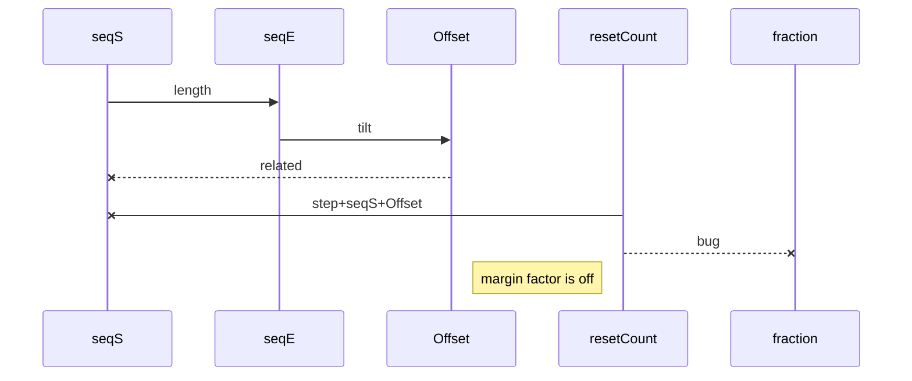
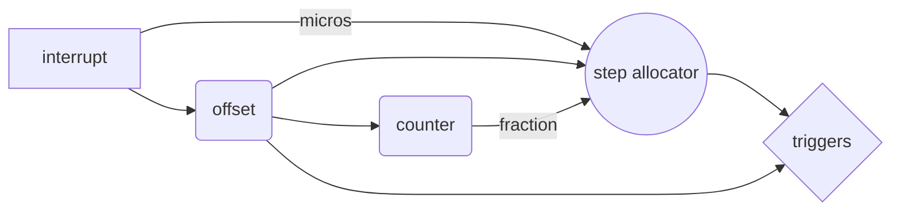

# TSEQ SDS8

A teensy based step sequencer made for the Simmons sds8
- with margin/rotation logic and clock multiplier/divider specially

version is from **workshop NMH, february 2019**

## notes

todo:
- l : voltage clamp on inputs
- II : reverse polar protect on outputs
- III : use linear B pots instead og log A
- IIII: add reverse traverser state for seq
- IIIII: introduces step skipping factor (bipolar in steps- add rand)

crude flow:

--> [sds 8 manual](https://www.simmonsmuseum.com/?area=downloads&download_id=120)
